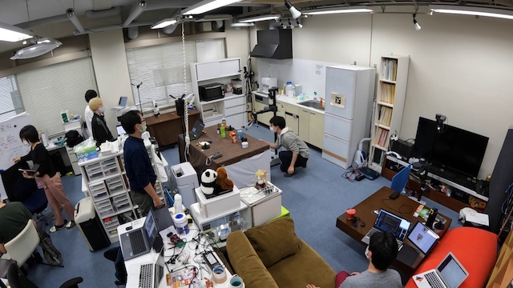

# 2023年度卒研配属情報

現在準備中です．情報は随時更新します．

## 研究室公開

- 日時：2023年11月25日（土），26（日）
  - 11時〜
  - 15時〜
- 場所：西8号館 5階 517号室
- 内容
  - 研究紹介
  - ロボットのデモ
  - 研究室メンバとの交流
  - 各日・各回の内容は同じです
- 教員（中村）は25日の午前は不在となる予定です．教員（中村）と話したい人は25日の15時〜の回か，26日に参加してください

## 研究室配属に関わる面談
配属の可否は，希望研究室登録の**締め切り後**の面談にて決定します．（締め切り前には面談は行いません．）
希望研究室登録が締め切られ次第，配属希望者はなるべく早く中村（tnakamuraあっとuec.ac.jp）までご連絡ください．

## 研究環境
- 西8号館418号室（学生部屋）

<blockquote data-width="500" data-height="375" class="ricoh-theta-spherical-image" >Post from RICOH THETA. - <a href="https://theta360.com/s/2rMDTntqBEiVDHaGAxH4u3dlQ" target="_blank">Spherical Image - RICOH THETA</a></blockquote>
  

- 西8号館517号室（学生部屋）
双腕ロボット，単腕ロボット，3Dプリンタ，レーザー加工機などがあります

<blockquote data-width="500" data-height="375" class="ricoh-theta-spherical-image" >Post from RICOH THETA. - <a href="https://theta360.com/s/s94HW9yhQlIxvU3Wxh3E5calk" target="_blank">Spherical Image - RICOH THETA</a></blockquote>
  

- 東9号館403号室（実験室）  
  家庭環境を模した実験室があります．ここで家庭用ロボットの開発・研究をしています．
  

- 各個人の研究環境
  - 各人に専用の椅子・机・PC・ディスプレイが割り当てられます
  - PCはいずれもGPUを搭載した高性能PCです
  - デュアルディスプレイ環境や，40インチの大型ディスプレイも選択可能です

- 研究に利用できる共有機材等
  - 複数の移動ロボット，アームロボットを所有しており，データを取ったり，研究成果の実証実験等に利用しています
  - 3Dプリンタとレーザー加工機があり，研究に必要なハードウェアの開発に利用しています
  - Nvidia A100を搭載した高性能GPUサーバーがあり，深層学習等の計算に利用できます

## よくある質問
よく受ける質問をまとめました．詳細やその他の質問は，研究室の学生に聞いてみてください．

- Q: コアタイムはありますか？
  - A: コアタイムは設定していません．週1回のミーティングに参加して，成果を出してくれれば，いつ来て，いつ帰っても自由です．ただし，基本的には平日は毎日研究室に来るようにはしてください．研究室に来ないと，教員からの指導が受けられず，研究が進みません．（現在はコロナウイルへの対応として，来れる人は研究室で，来れない人は在宅で研究を進めています．週1回のミーティングもzoomを使用して家から参加できるようにしています．） 

- Q: プログラムを書いた経験がほとんどないのですが大丈夫ですか？
  - A: 大丈夫です．当研究室に配属になった学生のほとんどがプログラミング経験はありませんでした．研究室に配属決定後に勉強して，できるようになってます．心配しなくて大丈夫です． 

- Q: 配属決定後に勉強しておいた方がいいものはありますか？
  - A: 1月頃に課題を出すので，その課題をやってください．サポートはしっかりするので，課題でわからないことがあれば積極的に研究室にきて先輩たちに質問してください．みんな優秀で優しい先輩たちです．  

- Q: 研究テーマはどのように決定しますか？
  - A: 教員が提案するパターンと，教員と学生で議論しながら決定するパターンの2つあります．やりたいことが明確に決まっていれば，やってもらって構いませんし，もし明確に決まってなければ，教員から提案もします．

- Q: 主に使用するプログラミング言語は何ですか？
  - A: ほぼすべての学生がPythonを使って開発しています．PythonはC言語やC++に比べて簡単な言語なので，配属決定後に勉強すれば，すぐ書けるようになります． 

- Q: P4でも問題ないでしょうか？
  - A: 全然問題ないです．P5であったとしても研究に関連した講義科目はないので，P4・P5どちらであっても研究室に配属になってから基礎知識の勉強から初めてもらいます． 

- Q: 配属されてから研究テーマの決定までの流れを教えてください。
  - A: まずは1月〜3月半ばくらいで基礎的な勉強をしてもらって，3月半ば〜4月は研究室に来て，より発展した内容を勉強してもらってます．その後，GW明けくらいに教員からテーマ案を提示して，その中から選んでもらっています．今年はコロナの影響でテーマの決定は遅かったです．

## その他の質問
[このフォーム](https://docs.google.com/forms/d/e/1FAIpQLSfBF4w8d9ai1aQHhxtl4VVyBXuTPOTVfHFOptZMMHPuV6Ecyw/viewform?usp=sf_link
)から質問を書き込んでください．匿名で質問可能なので，気軽に書き込んでください．回答はこのページで公開しようと思います．  

### 個別の質問への回答
- Q:[2023/11/06] 社会人博士は受け入れ可能でしょうか？
  - A: はい，受け入れています．なにか話を聞きたいことがあれば，中村までご連絡ください．
