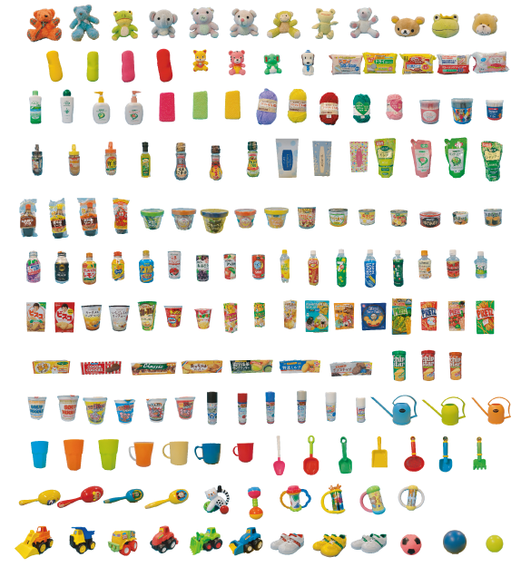

# Multimodal Object Dataset 165



This is multimodal object dataset obtained by the robot, and the details are described in this paper. 
This dataset is free for use in research projects. 

If you publish results obtained using this dataset, please cite: 
```
@article{nakamura2017ensemble,
  title={Ensemble-of-Concept Models for Unsupervised Formation of Multiple Categories},
  author={Nakamura, Tomoaki and Nagai, Takayuki},
  journal={IEEE Transactions on Cognitive and Developmental Systems},
  year={2017},
  doi = {10.1109/TCDS.2017.2745502},
  url = {http://ieeexplore.ieee.org/document/8023995/}
}
```

[Download](https://docs.google.com/forms/d/e/1FAIpQLSekN7U5XjZg0gvwAbeEYD_DqMulxRSHXl0ycSuw_qfxyPzQoQ/viewform)