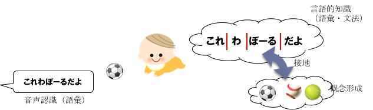
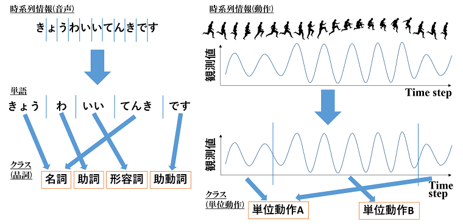
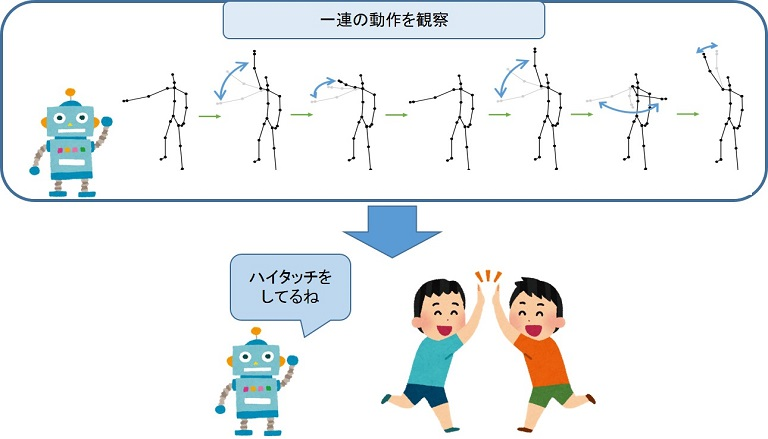
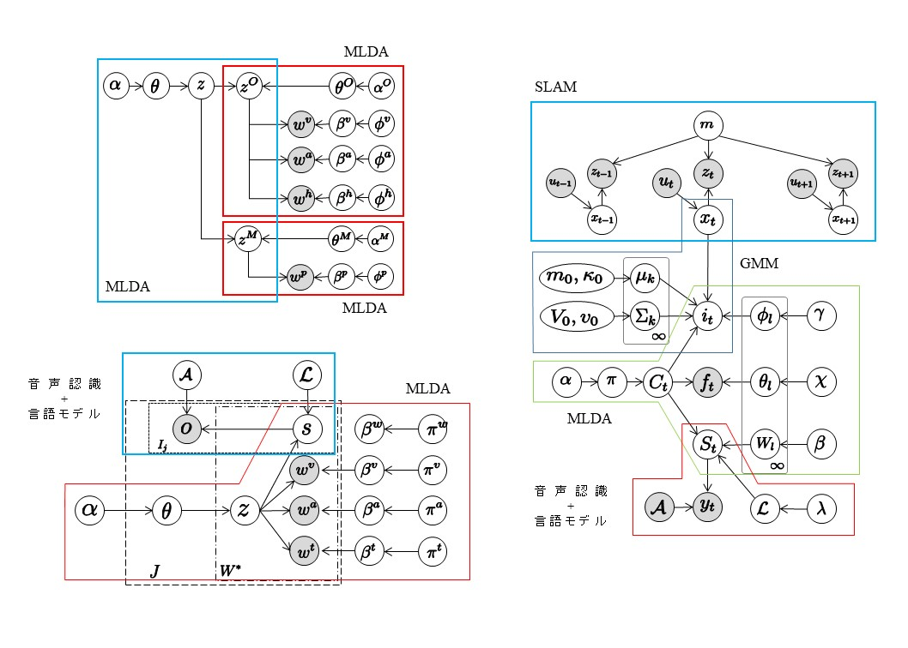

---
title: タイトル
layout: default
---

# 研究内容
人間は未熟な状態で生まれ活動をはじめます．そして環境適応しつつ様々な概念や行動を学習し，最終的には言語を用いた他者とのコミュニケーションも可能となります．当研究室では，そのような学習の数理モデルを構築し，人間のように様々な能力を自律的に獲得するロボットの実現を目指しています．さらに，このような研究の中で得られた要素技術を応用した知能システムに関する研究も行っています．

## ロボットによる概念・言語獲得
本研究では，人のように概念や言語を獲得するロボットを目指しています．ロボットは物体から得られる情報をカテゴリ分類することで物体の概念を形成し，人から教えられる文章に含まれる単語と結びつけることで単語の意味を獲得します．さらに教示文に含まれる単語の語順を学習することで，文法の獲得を実現しています．

### 参考文献
- Tomoaki Nakamura, and Takayuki Nagai, “Ensemble-of-Concept Models for Unsupervised Formation of Multiple Categories”, IEEE Transactions on Cognitive and Developmental Systems [[PDF]](https://ieeexplore.ieee.org/document/8023995)
- Joe Nishihara, Tomoaki Nakamura, Takayuki Nagai, “Online Algorithm for Robots to Learn Object Concepts and Language Model”, IEEE Transactions on Cognitive and Developmental Systems, Vol. 9, No. 3, pp. 255-268, Apr. 2017 [[PDF]](https://ieeexplore.ieee.org/document/7451222)
- 布川遼太郎，宮澤和貴，中村友昭，長井隆行，金子 正秀，”時系列マルチモーダル情報の分節・分類に基づく物体と動作の統合概念学習”，人工知能学会全国大会，1G3-05，Jun. 2018 [[PDF]](https://confit.atlas.jp/guide/event/jsai2018/subject/1G3-05/detail?lang=ja)
- 西原成，青木達哉，中村友昭，長井隆行，”階層ディリクレ過程を用いたロボットによる概念と言語の長期学習”，人工知能学会全国大会，2I3-3，Jun. 2016 [[PDF]](http://www.ai-gakkai.or.jp/jsai2016/webprogram/2016/paper-1074.html)

## 時系列情報の分節化
本研究では，ロボットが人のように言語や動作を柔軟に学習することを目指しています．ロボットは，音声波形や動作などの時系列情報を，明示的な分節点が与えられることなく分節化することで，意味を持つ単語や単位動作に分割し学習しています．さらに，類似する単語や単位動作を同じクラスに分類することで，その単語や動作の意味を獲得することができます．

### 参考文献
- 長野匡隼, 中村友昭, 長井隆行, 持橋大地, 小林一郎, 金子正秀, ”ノンパラメトリックベイズ法に基づく時系列データの分節化”, 人工知能学会全国大会, 2G4-04, Jun. 2018 [[PDF]](https://confit.atlas.jp/guide/event/jsai2018/subject/2G4-04/detail?lang=ja)
- Tomoaki Nakamura, Tayuki Nagai, Dichi Mochihashi, Ichiro Kobayashi, Hideki Asoh, and Masahide Kaneko, ”Segmenting Continuous Motions with Hidden Semi-Markov Models and Gaussian Processes”, Frontiers in Neurorobotics, vol.11, no.67,2017 [[PDF]](https://www.frontiersin.org/articles/10.3389/fnbot.2017.00067/full)

## インタラクションの学習
人間社会には様々なインタラクションが存在しており，人はそのようなインタラクションを自律的に学習しています．ロボットが人と共存するためには，ロボットも人と同様に自律的に学習することが重要となります．本研究ではロボットが二者間のインタラクションを観察することでインタラクション内の行動を学習し、さらに二者の行動間に存在するルールを推定することによりインタラクションを学習します。

### 参考文献
- 押川慧, 中村友昭, 長井隆行, 岩橋直人, 船越孝太郎, 中野幹生，金子正秀, ”Coupled GP-HSMMを用いた連続動作の分節化に基づくインタラクションのモデル化”, 人工知能学会全国大会, 4L2-04, Jun. 2018 [[PDF]](https://confit.atlas.jp/guide/event/jsai2018/subject/4L2-04/date?lang=ja)
- Satoru Oshikawa, Tomoaki Nakamura, Tayuki Nagai, Naoto Iwahashi, Kotaro Funakoshi, Mikio nakano, and Masahide Kaneko, ”Interaction Modeling Based on Segmenting Two Persons Motions Using Coupled GP-HSMM”, RO-MAN2018, pp.288-293,2018

## 大規模な学習モデル構築のためのアーキテクチャ
ロボットによる概念や言語の獲得をはじめ，私たちは様々な学習モデルを提案してきました．人のような知能の実現には，さらに複雑で大規模なモデルを構築する必要があります．しかし，モデルの規模が大きく複雑になるにつれて，実装することは困難になると考えられます．そこで，小規模で基礎的なモデルを組み合わせることによって大規模なモデルの構築を容易にするアーキテクチャSerketの研究・開発を行っています．[[プロジェクトページ]](http://serket.naka-lab.org/)

### 参考文献
- Tomoaki Nakamura, Takayuki Nagai and Tadahiro Taniguchi, “SERKET: An Architecture for Connecting Stochastic Models to Realize a Large-Scale Cognitive Model”, Frontiers in Neurorobotics, vol. 12, article 25, pp. 1-16, Jun. 2018 [[PDF]](https://www.frontiersin.org/articles/10.3389/fnbot.2018.00025/full)
- 國安瞭，中村友昭，青木達哉，谷口彰，尾崎僚，伊志嶺朝良，横山裕樹，小椋忠志，長井隆行，谷口忠大，”確率モデルの統合による大規模なモデルの実現 ～VAE, GMM, HMM, MLDAの統合モデルの実装と評価～”，情報論的学習理論ワークショップ，T-34，Nov. 2018

## ロボットによる自然言語理解
ロボットが家庭内で様々な作業を行う際に，人からの指示を正確に理解する必要があります．本研究では，人からの指示の整合性や周りの状況といった情報を使うことで，ノイズが多い環境においても，ロボットによる正確な指示理解を実現しています．

### 参考文献
- Takahiro Kobori, Tomoaki Nakamura, Mikio Nakano, Takayuki Nagai, Naoto Iwahashi, Kotaro Funakoshi, and Masahide Kaneko, "Robust Comprehension of Natural Language Instructions by a Domestic Service Robot", Advanced Robotics, Vol. 30, Issue 24, pp. 1530-1543, Nov. 2016 [[PDF]](https://www.tandfonline.com/doi/abs/10.1080/01691864.2016.1252689?journalCode=tadr20)
- 小堀嵩博，中村友昭，長井隆行，岩橋直人，船越孝太郎，中野幹生，金子正秀，"環境情報を考慮したロボットによる音声命令理解"，人工知能学会全国大会，1O2-3，Jun. 2016 [[PDF]](http://www.ai-gakkai.or.jp/jsai2016/webprogram/2016/paper-568.html)

