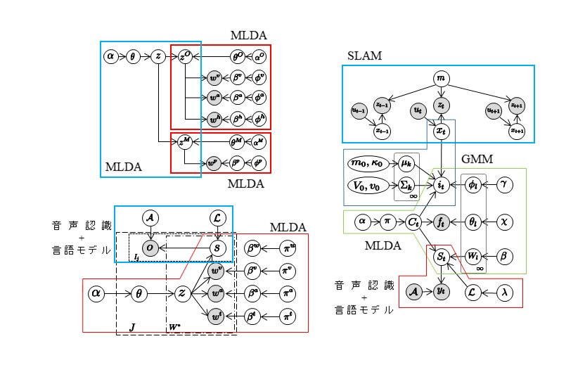

# 研究内容
人間は未熟な状態で生まれ活動をはじめます．そして環境適応しつつ様々な概念や行動を学習し，最終的には言語を用いた他者とのコミュニケーションも可能となります．当研究室では，そのような学習の数理モデルを構築し，人間のように様々な能力を自律的に獲得するロボットの実現を目指しています．さらに，このような研究の中で得られた要素技術を応用した知能システムに関する研究も行っています．

## ロボットによる概念・言語獲得
本研究では，人のように概念や言語を獲得するロボットを目指しています．ロボットは物体から得られる情報をカテゴリ分類することで物体の概念を形成し，人から教えられる文章に含まれる単語と結びつけることで単語の意味を獲得します．さらに教示文に含まれる単語の語順を学習することで，文法の獲得を実現しています．

### 参考文献
- 長野匡隼，中村友昭，”GP-HSMMに基づく二重分節化モデルによる連続音声の教師なし構造学習”，日本ロボット学会学術講演会，4F3-08，Sep. 2022
- Ryo Kuniyasu, Tomoaki Nakamura, Tadahiro Taniguchi, Takayuki Nagai, “Robot Concept Acquisition Based on Interaction between Probabilistic and Deep Generative Models”, Frontiers in Computer Science, Vol. 3, Article 618069, pp. 1-14, Sep. 2021 [[PDF]](https://www.frontiersin.org/articles/10.3389/fcomp.2021.618069/full)
- 長野匡隼，中村 友昭，"複数物体が存在する環境下での共同注意を用いたロボットによる語意学習"，日本ロボット学会誌, Vol. 39, No. 6, pp. 549-552, Jul. 2021
- Joe Nishihara, Tomoaki Nakamura, Takayuki Nagai, “Online Algorithm for Robots to Learn Object Concepts and Language Model”, IEEE Transactions on Cognitive and Developmental Systems, Vol. 9, No. 3, pp. 255-268, Apr. 2017 [[PDF]](https://ieeexplore.ieee.org/document/7451222)
- 西原成，青木達哉，中村友昭，長井隆行，”階層ディリクレ過程を用いたロボットによる概念と言語の長期学習”，人工知能学会全国大会，2I3-3，Jun. 2016 [[PDF]](http://www.ai-gakkai.or.jp/jsai2016/webprogram/2016/paper-1074.html)

 

## 言語の創発
言語はエージェントが環境と相互作用しながらボトムアップに創発される．さらに他者とのコミュニケーションによって意味が共有されることで，その集団の中で意図伝達が可能となる．
本研究では，ロボットがコミュニケーションによって言語を創発するための数理モデルの構築を目指しています．

### 参考文献
- Tomoaki Nakamura, Akira Taniguchi, Tadahiro Taniguchi, "Control as Probabilistic Inference as an Emergent Communication Mechanism in Multi-Agent Reinforcement Learning", arXiv:2307.05004, 2023 [[PDF]](https://arxiv.org/abs/2307.05004)
- 上田亮，谷口忠大，鈴木麗璽，江原広人，中村友昭，岩村入吹，橋本敬，"言語とコミュニケーションの創発に関する構成論的研究の展開"，PsyArXiv, 2023 [[PDF]](https://psyarxiv.com/rz5ng)
- 中村友昭，谷口彰，谷口忠大，”マルチエージェント記号創発に基づく協調的行動の学習と生成：Control as Inferenceとメトロポリス名付けゲームの融合”, 人工知能学会全国大会，4H3-OS-6b-05，Jun. 2023
- 江原広人，中村友昭，谷口彰，谷口忠大，”分散的ベイズ推論としてのマルチエージェント強化学習と記号創発”，言語処理学会全国大会，H10-5，Mar. 2023 [[PDF]](https://www.anlp.jp/proceedings/annual_meeting/2023/pdf_dir/H10-5.pdf)

 

## 複数の自律ロボットによる家庭内タスクの実現
家庭内には様々なタスクがあり，一台のロボットで全てを実行することは困難です．そこで本研究では複数の身体の異なるロボットが連携することで，家庭内のタスクを実行することを目的としています．またロボットが完全自律で実行できる行動は限られており，タスクの全てをロボットだけで遂行することは困難です．そのうようなロボットだけでは解決できない未知の状況に遭遇した時は，インターネットを通して人に支援を依頼し遠隔操作してもらうことで，未知の状況に対応します．さらに，その操作ログから学習することにより，新たな知識を獲得します．このプロジェクトは[内閣府ムーンショットプロジェクト 目標1「2050年までに、人が身体、脳、空間、時間の制約から解放された社会を実現」](https://www.avatar-ss.org/)の一環です．

<video controls width="500">
    <source src="mov/stretch.mp4" type="video/mp4">
</video>

### 参考文献
- Tatsuya Aoki, Tomoaki Nakamura, Takayuki Nagai, “Analysis of User Behavior and Workload During Simultaneous Tele-operation of Multiple Mobile Manipulators”, IROS2022, Oct. 2022 (accepted)
- Tomoaki Nakamura, Tadahiro Taniguchi and Akira Taniguchi, “Multi-agent collaboration through emergent communication based on metropolis-hastings”, JCoLE Workshop: Machine Learning and the Evolution of Language, Sep. 2022
- 江原広人，長野匡隼，中村友昭，”ロボットアームのたわみ量推定によるマニピュ レーションの高精度化”，日本ロボット学会学術講演会，4I3-06，Sep. 2022
- 長野匡隼, 岩田健輔, 平川拓実, 吉田武史, 青木達哉, 中村友昭, 長井隆行, “ROS1による複数ロボットの協調制御の実現”, 日本ロボット学会学術講演会, 2H2-06, Sep. 2021

 

## ロボットによる自然言語理解
ロボットが家庭内で様々な作業を行う際に，人からの指示を正確に理解する必要があります．本研究では，周りの環境の情報を使うことで，人からの曖昧な指示の理解を実現しています．

### 参考文献
- 森下雅晴，長野匡隼，中村友昭，”モバイルマニピュレーションタスクにおける曖昧な指示文からの対象物体選択”，言語処理学会全国大会，Q9-11，Mar. 2023 [[PDF]](https://www.anlp.jp/proceedings/annual_meeting/2023/pdf_dir/Q9-11.pdf)
- Takahiro Kobori, Tomoaki Nakamura, Mikio Nakano, Takayuki Nagai, Naoto Iwahashi, Kotaro Funakoshi, and Masahide Kaneko, "Robust Comprehension of Natural Language Instructions by a Domestic Service Robot", Advanced Robotics, Vol. 30, Issue 24, pp. 1530-1543, Nov. 2016 [[PDF]](https://www.tandfonline.com/doi/abs/10.1080/01691864.2016.1252689?journalCode=tadr20)
- 小堀嵩博，中村友昭，長井隆行，岩橋直人，船越孝太郎，中野幹生，金子正秀，"環境情報を考慮したロボットによる音声命令理解"，人工知能学会全国大会，1O2-3，Jun. 2016 [[PDF]](http://www.ai-gakkai.or.jp/jsai2016/webprogram/2016/paper-568.html)

 

## 時系列情報の分節化
本研究では，ロボットが人のように言語や動作を柔軟に学習することを目指しています．ロボットは，音声波形や動作などの時系列情報を，明示的な分節点が与えられることなく分節化することで，意味を持つ単語や単位動作に分割し学習しています．さらに，類似する単語や単位動作を同じクラスに分類することで，その単語や動作の意味を獲得することができます．

### 参考文献
- Masatoshi Nagano, Tomoaki Nakamura, Takayuki Nagai, Daichi Mochihashi and Ichiro Kobayashi, "Spatio-Temporal Categorization for First-Person-View Videos Using a Convolutional Variational Autoencoder and Gaussian Processes", Frontiers in Robotics and AI, Vol. 9, Sep. 2022 [[PDF]](https://www.frontiersin.org/articles/10.3389/frobt.2022.903450/full)
- 長野匡隼，中村友昭，長井隆行，持橋大地，小林一郎，高野渉，"畳み込み変分オートエンコーダとガウス過程に基づく動画像の分節化"，人工知能学会全国大会，2J3-GS-8b-01，Jun. 2021 [[PDF]](https://www.jstage.jst.go.jp/article/pjsai/JSAI2021/0/JSAI2021_2J3GS8b01/_pdf)
- Masatoshi Nagano, Tomoaki Nakamura, Takayuki Nagai, Daichi Mochihashi, Ichiro Kobayashi and Wataru Takano, "HVGH: Unsupervised Segmentation for High-dimensional Time Series Using Deep Neural Compression and Statistical Generative Model", Frontiers in Robotics and AI, Vol. 6, Article 115, pp. 1-15, Nov. 2019 [[PDF]](https://www.frontiersin.org/articles/10.3389/frobt.2019.00115/full)
- Masatoshi Nagano, Tomoaki Nakamura, Takayuki Nagai, Daichi Mochihashi, Ichiro Kobayashi, Masahide Kaneko, “Sequence Pattern Extraction by Segmenting Time Series Data Using GP-HSMM with Hierarchical Dirichlet Process”, IROS2018, pp. 4067-4074, Oct. 2018 [[PDF]](https://ieeexplore.ieee.org/document/8594029)
- 長野匡隼, 中村友昭, 長井隆行, 持橋大地, 小林一郎, 金子正秀, ”ノンパラメトリックベイズ法に基づく時系列データの分節化”, 人工知能学会全国大会, 2G4-04, Jun. 2018 [[PDF]](https://confit.atlas.jp/guide/event/jsai2018/subject/2G4-04/detail?lang=ja)
- Tomoaki Nakamura, Tayuki Nagai, Dichi Mochihashi, Ichiro Kobayashi, Hideki Asoh, and Masahide Kaneko, ”Segmenting Continuous Motions with Hidden Semi-Markov Models and Gaussian Processes”, Frontiers in Neurorobotics, vol.11, no.67,2017 [[PDF]](https://www.frontiersin.org/articles/10.3389/fnbot.2017.00067/full)

 

## 人・動物の動作解析
分節化の技術を応用することで，人や動物の動作解析に関する研究を行っています．人の工場での作業動作や，サルの餌取りの動作から，特徴的な行動の自動抽出を実現しています．

### 参考文献
- 齋藤一誠，中村友昭，八田俊之，藤田渉，渡邉信太郎，三輪祥太郎，”GP-HSMMに基づく二重分節解析による作業行動の解析”，人工知能学会全国大会，1M3-GS-10-05，Jun. 2023
- Koki Mimura, Jumpei Matsumoto, Daichi Mochihashi, Tomoaki Nakamura, Toshiyuki Hirabayashi, Makoto Higuchi, Takafumi Minamimoto, "Unsupervised decomposition and description of nonhuman primate behavior", bioRxiv 2023.03.04.531044, 2023 [[PDF]](https://www.biorxiv.org/content/10.1101/2023.03.04.531044v2)

 

## 大規模な学習モデル構築のためのアーキテクチャ
ロボットによる概念や言語の獲得をはじめ，私たちは様々な学習モデルを提案してきました．人のような知能の実現には，さらに複雑で大規模なモデルを構築する必要があります．しかし，モデルの規模が大きく複雑になるにつれて，実装することは困難になると考えられます．そこで，小規模で基礎的なモデルを組み合わせることによって大規模なモデルの構築を容易にするアーキテクチャSerketの研究・開発を行っています．[[プロジェクトページ]](http://serket.naka-lab.org/)

### 参考文献
- Tadahiro Taniguchi, Hiroshi Yamakawa, Takayuki Nagai, Kenji Doya, Masamichi Sakagami, Masahiro Suzuki, Tomoaki Nakamura, Akira Taniguchi, “A whole brain probabilistic generative model: Toward realizing cognitive architectures for developmental robots”, Neural Networks, Vol. 150, pp. 293-312, Jun. 2022 [[PDF]](https://www.sciencedirect.com/science/article/pii/S0893608022000673)
- Ryo Kuniyasu, Tomoaki Nakamura, Tadahiro Taniguchi, Takayuki Nagai, "Robot Concept Acquisition Based on Interaction between Probabilistic and Deep Generative Models", Frontiers in Computer Science, Vol. 3, Article 618069, pp. 1-14, Sep. 2021 [[PDF]](https://www.frontiersin.org/articles/10.3389/fcomp.2021.618069/full)
- 國安瞭，中村友昭，長井隆行，谷口忠大，”確率モデルの統合によるマルチモーダル学習モデルの構築”，人工知能学会全国大会，1L4-J-11-02，Jun. 2019 [[PDF]](https://confit.atlas.jp/guide/event-img/jsai2019/1L4-J-11-02/public/pdf?type=in)
- Tomoaki Nakamura, Takayuki Nagai and Tadahiro Taniguchi, “SERKET: An Architecture for Connecting Stochastic Models to Realize a Large-Scale Cognitive Model”, Frontiers in Neurorobotics, vol. 12, article 25, pp. 1-16, Jun. 2018 [[PDF]](https://www.frontiersin.org/articles/10.3389/fnbot.2018.00025/full)

 

## インタラクションの学習
人間社会には様々なインタラクションが存在しており，人はそのようなインタラクションを自律的に学習しています．ロボットが人と共存するためには，ロボットも人と同様に自律的に学習することが重要となります．本研究ではロボットが二者間のインタラクションを観察することでインタラクション内の行動を学習し、さらに二者の行動間に存在するルールを推定することによりインタラクションを学習します。

### 参考文献
- 木村大河，長野匡隼，中村友昭，"MC-GP-HSMMを用いたマルチモーダル情報の分節化によるインタラクションのルール学習"， 日本ロボット学会誌, Vol. 39, No. 6, pp. 553-556, Jul. 2021
- 押川慧, 中村友昭, 長井隆行, 岩橋直人, 船越孝太郎, 中野幹生，金子正秀, ”Coupled GP-HSMMを用いた連続動作の分節化に基づくインタラクションのモデル化”, 人工知能学会全国大会, 4L2-04, Jun. 2018 [[PDF]](https://confit.atlas.jp/guide/event/jsai2018/subject/4L2-04/date?lang=ja)
- Satoru Oshikawa, Tomoaki Nakamura, Tayuki Nagai, Naoto Iwahashi, Kotaro Funakoshi, Mikio nakano, and Masahide Kaneko, ”Interaction Modeling Based on Segmenting Two Persons Motions Using Coupled GP-HSMM”, RO-MAN2018, pp.288-293,2018 [[PDF]](https://ieeexplore.ieee.org/document/8525797)

 

## 保育AI
研究で得られた様々な人工知能(AI)の技術を応用した研究も行っています．この研究では，実際に保育園で子どもたちの行動を計測し，その情報を我々の技術を利用して解析することで，子どもたちの行動や状態を自動的に推定しています．最終的には，子どもたちの成長や，保育の質を定量化し，保育者へのフィードバックへ利用することを目指しています．

### 参考文献
- 山田徹志, 宮田真宏, 中村友昭, 前野隆司, 大森隆司, "機械学習を用いた「子どもの育ち」の可視化", 日本教育工学会論文誌, vol. 44, no. 4, Nov. 2020
- Ryo Matsumoto, Zhang Bin, Tomoaki Nakamura, Takayuki Nagai, Takashi Omori, and Natsuki Oka, "Robust Human Trajectory Estimation Using Hidden Markov Models", RISP International Workshop on Nonlinear Circuits, Communications and Signal Processing, pp. 13-16, Feb. 2020
- Yoshiki Higuchi, Kasumi Abe, Masatoshi Nagano, Rena Kanai, Masahiro Shiomi, Takayuki Nagai and Tomoaki Nakamura, "HSMM-SA-based Analysis of ChildcareWorker’s Interaction Strategy", RISP International Workshop on Nonlinear Circuits, Communications and Signal Processing, pp. 1-4, Feb. 2020
- Bin Zhang, Tomoaki Nakamura, Rena Ushiogi, Takayuki Nagai, Kasumi Abe, Takashi Omori, Natsuki Oka, and Masahide Kaneko, "Robust Children Behavior Tracking for Childcare Assisting Robot By Using Multiple Kinect Sensors", International Conference on Social Robotics, pp.640-649, Nov. 2016 [[PDF]](https://link.springer.com/chapter/10.1007/978-3-319-47437-3_63)
- 肥田竜馬，山田徹志，張斌，宮田真宏，石川久悟，根岸諒平，大森隆司，中村友昭，長井隆行，岡夏樹，"保育の質の定量化のための人間行動センシングと解析ツールの開発"，人工知能学会全国大会，2H3-OS-35a-5，May 2017 [[PDF]](http://www.ai-gakkai.or.jp/jsai2017/webprogram/2017/pdf/343.pdf)
- 大森隆司，アッタミミムハンマド，山田徹志，中村友昭，肥田竜馬，阿部香澄，長井隆行，岡夏樹，西村拓一，"保育AI：心の発達を理解するAIの可能性"，人工知能学会全国大会，2E4-OS-12a-6，Jun. 2016 [[PDF]](https://www.ai-gakkai.or.jp/jsai2016/webprogram/2016/pdf/735.pdf)
